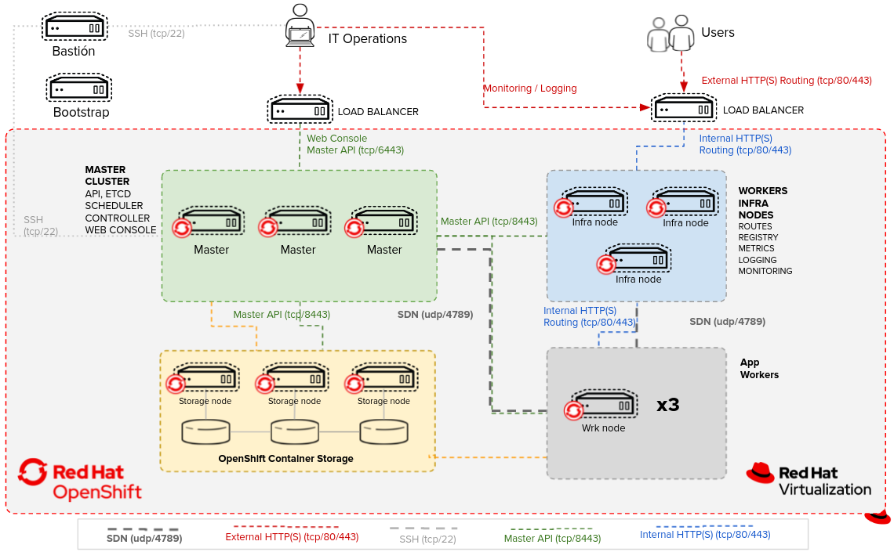

# OpenShift 4 Bare Metal Instalacion - User Provisioned Infraestructure (UPI)

## Guia de instalacion paso a paso de OpenShift 4 UPI

- [OpenShift 4 Bare Metal ](#openshift-4-bare-metal)
    - [Diagrama de arquitectura](#diagrama-de-arquitectura)
    - [Descargas](#descargas)
    - [Instalacion y Configuracion de RHEL - Bastion](#instalacion-y-configuracion-del-rhel---bastion)
    - [Instalación y Configuración DNS](#instalacion-y-configuracion-del-dns)
    - [Instalación y Configuración HAProxy](#instalacion-y-configuracion-del-haproxy)
    - [Instalación y Configuración Apache](#instalacion-y-configuracion-del-apache)
    - [Maquinas Virtuales](#maquinas-virtuales)
    - [Instalación del cliente](#instalacion-del-cliente)
    - [Archivo de Instalación](#archivo-de-instalacion)
    - [Creacion de Ignition Files](#creacion-de-ignition-files)
    - [Despliege de OpenShift](#despliegue-de-openshift)
    - [Monitoreo de la Instalacion](#monitoreo-de-la-instalacion)

## Diagrama de arquitectura



## Descargas

1. Red Hat Enterprise Linux [RHEL](https://access.redhat.com/downloads/content/479/)
1. Ingresar en [Create an OpenShift cluster](https://console.redhat.com/openshift)
1. Seleccionar "Create Cluster" - "Datacenter" - "Bare Metal (x86_64)" - "User-provisioned infrastructure"
1. Descargamos los siguientes archivos
    - OpenShift Installer - openshift-install-linux.tar.gz
    - Pull Secret
    - Cliente de OpenShift - openshift-client-linux.tar.gz
    - Red Hat Enterprise Linux CoreOs (RHCOS)
        - rhcos-X.X.X-x86_64-metal.x86_64.raw.gz
        - rhcos-X.X.X-x86_64-installer.x86_64.iso

## Instalacion y Configuracion del RHEL - Bastion

Se debe instalar RHEL en una maquina virtual con las siguientes caracteristicas minimas, desde esta maquina se lanzara la instalación de OpenShift.

Sistema Operativo | vCores | Ram | Storage
:---:|:---:|:---:|:---:
RHEL 8 | 2 | 8 GB | 100 GB

Una vez creada esta maquina se deben agregar los siguientes programas, despues de actualizar todos los paquetes

```bash
   dnf update
```

## Instalacion y Configuracion del DNS

Instalamos BIND que sera el servidor de DNS para todas las rutas de OpenShift.

```bash
    dnf install bind bind-utils -y
```

Se debe modificar el archivo /etc/named.conf con las siguientes configuraciones o remplazar el archivo con el que esta en el git.

> *Se deberan considerar las IPs de su Red* 

Se debe agregar la ip del servidor DNS, en este caso se comenta la red de IPv6
```
        listen-on port 53 {127.0.0.1; 10.2.82.1; };
#       listen-on-v6 port 53 { ::1; };
```

Agregamos los DNS de google y se agrega el segmento de red de las maquinas
```
        forwarders      {8.8.8.8; 8.8.4.4;};
        allow-query     { localhost; 10.2.82.0/24;};
```

**Zona Directa** Se debe agregar el archivo *name-directa* en la siguiente ruta "/var/named/"

Configuración en el archivo *named.conf*
```
zone "openshift.xxx.gob.mx" IN {
        type master;
        file "directa";
        allow-update { none; };
};
```

Archivo *named-directa*
```
$TTL    86400
@               IN SOA openshift.xxx.gob.mx. root (
42              ; serial
3H              ; refresh
15M             ; retry
1W              ; expiry
1D )            ; minimum
                IN NS           ns
;use IP address of named machine for ns
ns              IN A          10.2.82.1
api             IN      A       10.2.82.1 
api-int         IN      A       10.2.82.1 
*.apps          IN      A       10.2.82.1 
bootstrap       IN      A       10.2.82.2 
master0         IN      A       10.2.82.3 
master1         IN      A       10.2.82.4 
master2         IN      A       10.2.82.5 
worker0         IN      A       10.2.82.6 
worker1         IN      A       10.2.82.7 
worker2         IN      A       10.2.82.8
```

**Zona Inversa** Se debe agregar el archivo *name-inversa* en la siguiente ruta "/var/named/"

Configuración en el archivo *named.conf*
```
zone "82.2.10.in-addr.arpa" IN {
        type master;
        file "inversa";
        allow-update { none; };
};
```
Archivo *named-inversa*
```
$TTL    86400
@       IN      SOA     openshift.xxx.gob.mx. root.openshift.xxx.gob.mx.  (
    1997022700 ; serial
    28800      ; refresh
    14400      ; retry
    3600000    ; expire
    86400 )    ; minimum
@ IN      NS      ns.openshift.xxx.gob.mx.
1 IN      PTR     api.openshift.xxx.gob.mx. 
1 IN      PTR     api-int.openshift.xxx.gob.mx. 
2 IN      PTR     bootstrap.openshift.xxx.gob.mx. 
3 IN      PTR     master0.openshift.xxx.gob.mx. 
4 IN      PTR     master1.openshift.xxx.gob.mx. 
5 IN      PTR     master2.openshift.xxx.gob.mx. 
6 IN      PTR     worker0.openshift.xxx.gob.mx. 
7 IN      PTR     worker1.openshift.xxx.gob.mx. 
8 IN      PTR     worker2.openshift.xxx.gob.mx.
```

Se debe agregar el servidor de DNS al basion para poder realizar las pruebas en el archivo */etc/resolve.conf*

```bash
nameserver 10.2.82.1
```

Se debe confirmar que funcione de manera correcta el DNS

```bash
dig api.openshift.xxx.gob.mx

dig -x 10.2.82.1
```

## Instalacion y Configuracion del HAProxy

Instalamos el balanceador que se encargara de mandar las peticiones a cada maquina de OpenShift.

```bash
   dnf install haproxy -y
```

Se debe modificar el archivo /etc/haproxy/haproxy.conf con las siguiente configuraciones o remplazar el archivo con el que esta en este git. 

> *Se deberan considerar las IPs de su Red* 

**Kubernetes API Server**
 ```
#---------------------------------------------------------------------
# frontend to OpenShift K8s API Server                                
#---------------------------------------------------------------------
frontend openshift-api-server
    bind *:6443
    default_backend openshift-api-server
    mode tcp
#---------------------------------------------------------------------
# backend to OpenShift K8s API Server                                 
#---------------------------------------------------------------------
backend openshift-api-server
    balance source
    mode tcp
#    server bootstrap  10.2.82.2:6443 check
    server master0  10.2.82.3:6443 check
    server master1  10.2.82.4:6443 check
    server master2  10.2.82.5:6443 check
```
**Machine Config Server**
```
#---------------------------------------------------------------------
# frontend to OpenShift Machine Config Server                         
#---------------------------------------------------------------------
frontend machine-config-server
    bind *:22623
    default_backend machine-config-server
    mode tcp
#---------------------------------------------------------------------
# backend to OpenShift Machine Config Server                          
#---------------------------------------------------------------------
backend machine-config-server
    balance source
    mode tcp
#    server bootstrap 10.2.82.2:22623 check
    server master0  10.2.82.3:22623 check
    server master1  10.2.82.4:22623 check
    server master2  10.2.82.5:22623 check
```
**HTTP Traffic**
```
frontend ingress-http
    bind *:80
    default_backend ingress-http
    mode tcp
    option tcplog

backend ingress-http
    balance source
    mode tcp
    server worker0 10.2.82.6:80 check
    server worker1 10.2.82.7:80 check
    server worker2 10.2.82.8:80 check
```
**HTTPS Traffic**
```
frontend ingress-https
    bind *:443
    default_backend ingress-https
    mode tcp
    option tcplog

backend ingress-https
    balance source
    mode tcp
    server worker0 10.2.82.6:443 check
    server worker1 10.2.82.7:443 check
    server worker2 10.2.82.8:443 check
 ```

## Servidor Apache

Instalamos Apache para poder tener los archivos de los ignition de los servidores y el raw del CoreOS.

```bash
   dnf install httpd -y
```

Modificamos el puerto por default por el puerto 8080

```bash
   sed -i 's/Listen 80/Listen 0.0.0.0:8080/' /etc/httpd/conf/httpd.conf
```

Creamos dos carpetas para copiar mas adelante los archivos en las carpetas */var/www/html/ignitions/* y */var/www/html/raw/*

## Maquinas Virtuales

Las maquinas virtuales de los master, los workers y el bootstrap se deben crear con las siguientes caracteristicas, solo las definiciones, no se deben iniciar

Las maquinas se deben crear en una red donde todas las maquinas puedan verse a travez de las IPs.

La ISO de CoreOs se debe agregar al hipervisor, para tenerlo disponible cuando se arranquen las maquinas.

Maquina | Sistema Operativo | vCores | Ram | Storage
:---:|:---:|:---:|:---:|:---:
Bootstrap | CoreOS | 4 | 16 GB | 100 GB
Master | CoreOS | 4 | 16 GB | 100 GB
Worker | CoreOS | 4 | 16 GB | 100 GB

## Instalacion del cliente

El cliente se debe instalar en la maquina de bastion para ejectuar todos los comandos de instalacion desde está.

1. Extraemos el cliente y lo copiamos a `/usr/local/bin`

   ```bash
   tar xvf openshift-client-linux.tar.gz
   mv oc kubectl /usr/local/bin
   ```

1. Confirmamos la version de OpenShift instalada

   ```bash
   kubectl version
   oc version
   ```
## Archivo de Instalacion

Extraemos el instalador de OpenShift

```bash
   tar xvf openshift-install-linux.tar.gz
```

## Creacion de Ignition Files

Generamos  la llave del SSH key

```bash
   ssh-keygen
```

Creamos una carpeta para almacenar todos los archivos de instalación

```bash
   mkdir ~/ocp-install
```

Vamos a crear el archivo de instalacion *install-config.yaml*

- Vamos a agregar el pull-secret.txt
- Vamos a agregar el *~/.ssh/id__rsa.pub*

```bash
   vim ~/ocp-install/install-config.yaml
```
- Vamos a crear una copia del *install-config.yaml*, por si llegamos a necesitarlo otravez.

```bash
   cp ~/ocp-install/install-config.yaml ~/.
```

Generamos los manifests

```bash
   ~/openshift-install create manifests --dir ~/ocp-install
```

Generamos los ignitions

```bash
   ~/openshift-install create ignition-configs --dir ~/ocp-install/
```

Copiamos los ignition en la carpeta del servidor apache

```bash
   cp -R ~/ocp-install/* /var/www/html/ignitions
```

Tambien movemos el Raw de CoreOs a la carpeta del servidor apache

```bash
   mv ~/rhcos-X.X.X-x86_64-metal.x86_64.raw.gz /var/www/html/raw
```

Cambiamos los permisos de las carpetas del servidor apache

```bash
   chcon -R -t httpd_sys_content_t /var/www/html/ocp4/
   chown -R apache: /var/www/html/ocp4/
   chmod 755 /var/www/html/ocp4/
```

Verificamos que podamos llegar a las carpetas del servidor

```bash
   curl localhost:8080/ocp4/
```

## Despliegue de OpenShift

Cuando se despliegue cada maquina se debe pasar esta informacion al inicio de la maquina, para que nos deje escribir necesitamos presionar tab al iniciar la maquina.

- Bootstrap

```bash
   ip:10.2.82.3::10.2.82.254:255.255.255.0:bootstrap.openshift.segob.com.mx:ens192:none nameserver=10.2.82.1 coreos.inst.install_dev=sda coreos.inst.image_url=http://10.2.82.1:8080/raw/rhcos.raw.gz coreos.inst.ignition_url=http://10.2.82.1:8080/ignitions/bootstrap.ign 
```

- Master

```bash
   ip:10.2.82.3::10.2.82.254:255.255.255.0:bootstrap.openshift.segob.com.mx:ens192:none nameserver=10.2.82.1 coreos.inst.install_dev=sda coreos.inst.image_url=http://10.2.82.1:8080/raw/rhcos.raw.gz coreos.inst.ignition_url=http://10.2.82.1:8080/ignitions/master.ign
```

- Worker

```bash
   ip:10.2.82.3::10.2.82.254:255.255.255.0:bootstrap.openshift.segob.com.mx:ens192:none nameserver=10.2.82.1 coreos.inst.install_dev=sda coreos.inst.image_url=http://10.2.82.1:8080/raw/rhcos.raw.gz coreos.inst.ignition_url=http://10.2.82.1:8080/ignitions/worker.ign 
```

## Monitoreo de la Instalacion

Vamos a monitorear la instalacion del Bootstrap

```bash
   ~/openshift-install --dir ~/ocp-install wait-for bootstrap-complete --log-level=debug
```

Una vez terminado de instalarse el bootstrap vamos a monitorear las instlacion de todo el cluster

```bash
   ~/openshift-install --dir ~/ocp-install wait-for bootstrap-complete --log-level=debug
```
